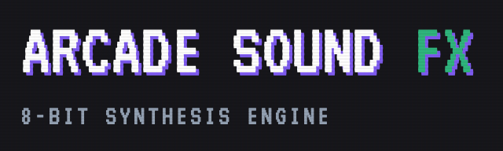

# Retro Arcade SFX Gen

<p align="center">
  
</p>

<p align="center">
  <strong><a href="https://tteuber.github.io/ArcadeSoundFX/">▶ Live Demo</a></strong>
</p>

A browser-based 8-bit sound effects generator inspired by classic 80s arcade machines. Dial in coins, lasers, jumps, explosions, and power-ups with a dual-oscillator synth engine — then export them as WAV files for use in games or other projects.

## Features

- **Dual-oscillator synth engine** — a tone oscillator (square / saw / triangle / sine) layered with a noise oscillator (white / pink / brown) for everything from clean melodic blips to gritty impacts.
- **Modulation** — independent amplitude (AD) and pitch (AD) envelopes plus a vibrato LFO, giving you the classic pitch sweeps and wobbles that define arcade SFX.
- **Curated presets** — Coin, Laser, Explosion, Jump, and Powerup as starting points.
- **Randomize** — generates a new sound on every click for fast inspiration.
- **WAV export** — render the patch offline through Tone.js and download as a 16-bit PCM WAV.
- **Live waveform visualizer** — real-time oscilloscope readout while you tweak.
- **CRT-styled retro UI** — VT323 type, scanline overlay, and a chunky neon control panel.

## Tech Stack

- **React 19** + **TypeScript** — component-driven UI with strict typing across the synth parameter model.
- **Tone.js** — Web Audio synthesis graph (oscillators, noise sources, amplitude envelope, LFO, limiter) plus offline rendering for WAV export.
- **Vite 6** — dev server and build tooling.
- **Tailwind CSS** — utility-first styling for the retro arcade aesthetic.
- **Custom WAV encoder** — converts the rendered `AudioBuffer` to a downloadable 16-bit PCM WAV blob without third-party audio libraries.

## Architecture

```
App.tsx                 # UI, state, preset & randomize logic
services/
  audioEngine.ts        # Tone.js signal graph + live trigger + offline render
components/
  Slider.tsx            # Reusable retro range slider
  OscVisualizer.tsx     # Live waveform oscilloscope
utils/
  wavEncoder.ts         # AudioBuffer → 16-bit PCM WAV encoder
types.ts                # SynthParams, WaveType, NoiseType
constants.ts            # Default params + preset definitions
```

The signal flow mirrors a classic mono synth voice:

```
[Tone Osc]  ─▶ [Gain] ─┐
                       ├─▶ [Amp Envelope] ─▶ [Limiter] ─▶ [Master] ─▶ Output
[Noise Osc] ─▶ [Gain] ─┘                                       │
[LFO] ─▶ osc.detune (vibrato)                                  └─▶ [Waveform Analyser]
```

The pitch envelope is driven by scheduled `linearRampToValueAtTime` / `exponentialRampToValueAtTime` calls on the oscillator's frequency parameter, allowing flexible up/down sweeps in octaves.

## Run Locally

**Prerequisites:** Node.js 18+

```bash
npm install
npm run dev
```

Then open <http://localhost:3000>.

To build for production:

```bash
npm run build
npm run preview
```

## Why I Built This

I built this for my students. In my teaching job, I had kids building arcade-style games in Pygame and Scratch, and their projects were silent — finding or making decent sound effects was a real friction point for them. I wanted a tool they could open in a browser, click a preset or hit randomize, and walk away thirty seconds later with a usable WAV file to drop into their game. Keeping the UI direct and the export one click away were the design goals that fell out of that.
