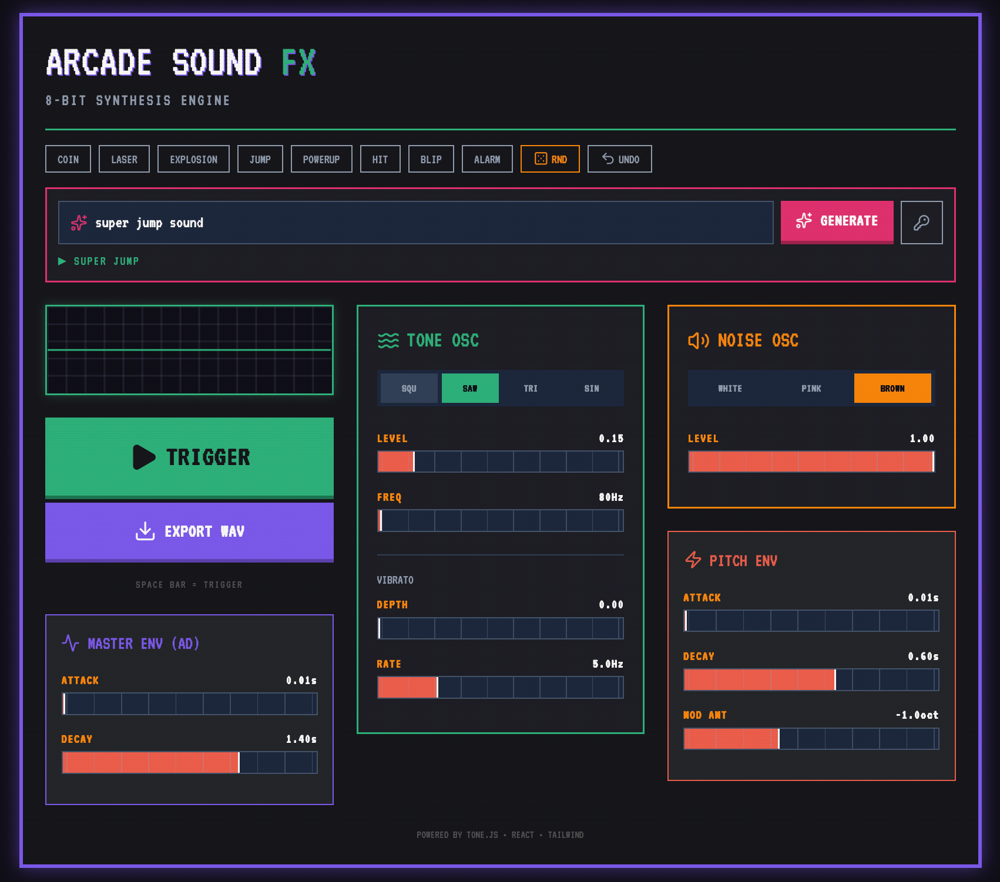

# ArcadeSoundFX

<p align="center">
  
</p>

<p align="center">
  <strong><a href="https://tteuber.github.io/ArcadeSoundFX/">▶ Live Demo</a></strong>
  <br />
  <a href="https://github.com/TTeuber/ArcadeSoundFX/actions/workflows/ci.yml"></a>
</p>

A browser-based 8-bit sound effects generator inspired by classic 80s arcade machines. Dial in coins, lasers, jumps, explosions, and power-ups with a dual-oscillator synth engine — then export them as WAV files for use in games or other projects.

<p align="center">
  
</p>

## Features

- **Dual-oscillator synth engine** — a tone oscillator (square / saw / triangle / sine) layered with a noise oscillator (white / pink / brown) for everything from clean melodic blips to gritty impacts.
- **Modulation** — independent amplitude (AD) and pitch (AD) envelopes plus a vibrato LFO, giving you the classic pitch sweeps and wobbles that define arcade SFX.
- **Describe a sound, get a sound** — an AI prompt bar ("a sad laser powering down") that turns text into synth parameters via the Claude API, behind a rate-limited Cloudflare Worker proxy — or bring your own API key.
- **Curated presets** — Coin, Laser, Explosion, Jump, Powerup, Hit, Blip, and Alarm as starting points.
- **Smart randomize + undo** — randomization jitters around preset archetypes (with the occasional wild roll) so results stay usable, and the previous sound is always one Undo away.
- **Shareable URLs** — the full patch is encoded in the URL hash, so any sound can be linked or bookmarked.
- **WAV export** — render the patch offline through Tone.js and download as a 16-bit PCM WAV.
- **Live waveform visualizer** — real-time oscilloscope readout while you tweak; spacebar re-triggers the sound.
- **CRT-styled retro UI** — VT323 type, scanline overlay, and a chunky neon control panel.

## Tech Stack

- **React 19** + **TypeScript** — component-driven UI with strict typing across the synth parameter model.
- **Tone.js** — Web Audio synthesis graph (oscillators, noise sources, amplitude envelope, LFO, limiter) plus offline rendering for WAV export.
- **Vite 6** — dev server and build tooling.
- **Tailwind CSS 4** — utility-first styling for the retro arcade aesthetic, compiled at build time via `@tailwindcss/vite`.
- **Vitest** — unit tests for the WAV encoder (RIFF header layout, PCM conversion, channel interleaving).
- **Custom WAV encoder** — converts the rendered `AudioBuffer` to a downloadable 16-bit PCM WAV blob without third-party audio libraries.

## Architecture

```
App.tsx                 # UI, state, preset/randomize/undo/share logic
services/
  audioEngine.ts        # Tone.js signal graph + live trigger + offline render
  soundPrompt.ts        # AI generation client (Worker proxy or user's own key)
  soundSchema.ts        # System prompt + JSON schema for sound generation
  llmConfig.ts          # Worker URL + model config
components/
  Slider.tsx            # Reusable retro range slider
  OscVisualizer.tsx     # Live waveform oscilloscope
  PromptBar.tsx         # "Describe a sound" AI input
utils/
  wavEncoder.ts         # AudioBuffer → 16-bit PCM WAV encoder
  params.ts             # Param bounds, clamping, sanitization
  urlState.ts           # SynthParams ⇄ URL hash
types.ts                # SynthParams, WaveType, NoiseType
constants.ts            # Default params + preset definitions
worker/                 # Cloudflare Worker: rate-limited Anthropic API proxy
```

### AI backend

The frontend stays a static GitHub Pages site; AI requests go to a small Cloudflare
Worker (`worker/`) that holds the Anthropic API key as a secret and enforces
origin-locked CORS, per-IP and global daily rate limits (Workers KV), and a capped
response size. The model returns schema-validated JSON (Claude structured outputs),
which the client additionally clamps to slider ranges. Visitors can alternatively
supply their own API key, which is stored in localStorage and sent directly from the
browser to Anthropic — it never touches the Worker.

The signal flow mirrors a classic mono synth voice:

```
[Tone Osc]  ─▶ [Gain] ─┐
                       ├─▶ [Amp Envelope] ─▶ [Limiter] ─▶ [Master] ─▶ Output
[Noise Osc] ─▶ [Gain] ─┘                                       │
[LFO] ─▶ osc.detune (vibrato)                                  └─▶ [Waveform Analyser]
```

The pitch envelope is driven by scheduled `linearRampToValueAtTime` / `exponentialRampToValueAtTime` calls on the oscillator's frequency parameter, allowing flexible up/down sweeps in octaves.

## Run Locally

**Prerequisites:** Node.js 18+

```bash
npm install
npm run dev
```

Then open <http://localhost:3000>.

To build for production:

```bash
npm run build
npm run preview
```

Tests and type checking:

```bash
npm test
npm run typecheck
```

Pushes to `main` are built, tested, and deployed to GitHub Pages automatically via GitHub Actions.

### Deploying your own AI backend (optional)

The site works fully without it (the AI bar falls back to bring-your-own-key mode).
To run the shared backend on a free Cloudflare account:

```bash
cd worker
npm install
npx wrangler kv namespace create RATE_LIMITS   # paste the id into wrangler.jsonc
npx wrangler secret put ANTHROPIC_API_KEY
npx wrangler deploy
```

Then set the printed Worker URL as `WORKER_URL` in `services/llmConfig.ts`. Origins,
daily rate limits, and the model are configured in `worker/wrangler.jsonc`.

## Why I Built This

I built this for my students. In my teaching job, I had kids building arcade-style games in Pygame and Scratch, and their projects were silent — finding or making decent sound effects was a real friction point for them. I wanted a tool they could open in a browser, click a preset or hit randomize, and walk away thirty seconds later with a usable WAV file to drop into their game. Keeping the UI direct and the export one click away were the design goals that fell out of that.

## License

[MIT](LICENSE)
